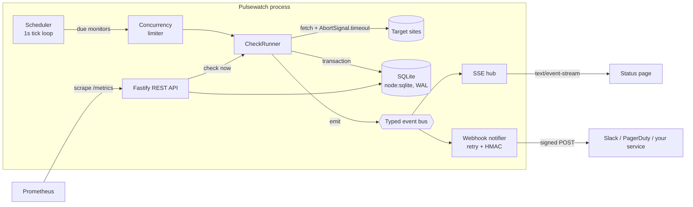

# Pulsewatch

**Self-hosted uptime monitoring for HTTP services.** Pulsewatch checks your endpoints on a schedule, detects outages, sends signed webhook alerts and serves a live status page. It also exposes Prometheus metrics, so it can sit next to an existing observability stack.

It runs on **Node.js 24** with **native TypeScript** (no build step), the **built-in `node:sqlite`** database and the **built-in `node:test`** runner. It has three runtime dependencies: `fastify`, `pino` and `zod`.


---

## Features

- **Scheduled HTTP checks**: per-monitor interval, timeout, HTTP method and expected status. Latency is measured to the response headers.
- **Incident detection**: an incident opens after *N* consecutive failures, so a single blip doesn't alert. It resolves automatically on recovery. A partial unique index in the database ensures each monitor has at most one open incident.
- **Webhook alerts**: retries with exponential backoff and jitter. Permanent 4xx errors are not retried. Payloads carry a Stripe-style **HMAC-SHA256 signature** with replay protection.
- **Live status page**: a public dashboard that updates in real time over **Server-Sent Events**. Target URLs stay private.
- **REST API**: API-key auth with constant-time comparison, Zod validation with field-level errors, cursor pagination, and uptime / average / p95 latency stats.
- **Production concerns**:
  - Prometheus `/metrics`, including event-loop delay
  - liveness and readiness probes
  - structured JSON logs with request IDs and redacted secrets
  - per-client rate limiting
  - security headers
  - graceful shutdown
  - data retention
- **Shipping**: multi-stage Docker image running as a non-root user, with a healthcheck. GitHub Actions CI runs on Linux and Windows with Node 24 and 25.

## Quick start

```bash
git clone https://github.com/<your-username>/pulsewatch.git
cd pulsewatch
npm install
cp .env.example .env          # then set API_KEY to a long random string
npm run seed                  # optional: adds a few demo monitors
npm run dev                   # http://localhost:3000
```

Open **http://localhost:3000** to see the live status page.

**With Docker:**

```bash
API_KEY=$(node -e "console.log(crypto.randomBytes(24).toString('base64url'))") docker compose up --build
```

## Architecture



```
src/
├── server.ts            Entry point: config → context → HTTP server → scheduler, plus graceful shutdown
├── app.ts               Fastify app factory (hooks, error handling, routes); testable via app.inject()
├── context.ts           Composition root: wires every dependency explicitly
├── config.ts            Env validation with Zod (fails fast with readable errors)
├── db/                  node:sqlite setup and versioned migrations (PRAGMA user_version)
├── repositories/        SQL with prepared statements; maps rows ↔ domain types
├── services/
│   ├── checker.ts       One HTTP probe: timeout, abort, error classification
│   ├── check-runner.ts  Probe → persist → incident state machine → events
│   ├── scheduler.ts     Decides what is due; bounded concurrency; retention
│   ├── notifier.ts      Webhook delivery, signing and verification
│   └── events.ts        Strongly-typed EventEmitter
├── http/                Auth, errors, SSE hub, serializers
├── routes/              Authenticated management API and public endpoints
└── lib/                 Dependency-free building blocks: concurrency limiter, retry,
                         token-bucket rate limiter, Prometheus registry
```

## API

Endpoints under `/api/monitors` require `Authorization: Bearer <API_KEY>` (or the `X-API-Key` header).

| Method   | Path                                | Description                                    |
| -------- | ----------------------------------- | ---------------------------------------------- |
| `GET`    | `/api/monitors`                     | List monitors                                  |
| `POST`   | `/api/monitors`                     | Create a monitor                               |
| `GET`    | `/api/monitors/:id`                 | Get a monitor                                  |
| `PATCH`  | `/api/monitors/:id`                 | Partially update (e.g. pause, change interval) |
| `DELETE` | `/api/monitors/:id`                 | Delete a monitor and its history               |
| `POST`   | `/api/monitors/:id/check`           | Run a check immediately                        |
| `GET`    | `/api/monitors/:id/checks`          | Check history (`?limit=50&before=<cursor>`)    |
| `GET`    | `/api/monitors/:id/stats`           | Uptime and latency (`?window=1h\|24h\|7d\|30d`) |
| `GET`    | `/api/monitors/:id/incidents`       | Incident history                               |
| `GET`    | `/api/status`                       | **Public** status summary (no URLs)            |
| `GET`    | `/api/events`                       | **Public** live event stream (SSE)             |
| `GET`    | `/health/live`, `/health/ready`     | Liveness and readiness probes                  |
| `GET`    | `/metrics`                          | Prometheus metrics                             |

**Create a monitor:**

```bash
curl -X POST http://localhost:3000/api/monitors \
  -H "Authorization: Bearer $API_KEY" \
  -H "Content-Type: application/json" \
  -d '{
    "name": "Production API",
    "url": "https://api.example.com/health",
    "intervalSeconds": 30,
    "timeoutMs": 3000,
    "failureThreshold": 3,
    "webhookUrl": "https://hooks.example.com/pulsewatch"
  }'
```

**Errors share one envelope:**

```json
{
  "error": {
    "code": "validation_failed",
    "message": "Request validation failed",
    "details": [{ "path": "url", "message": "must be a valid http(s) URL" }]
  }
}
```

### Webhooks

When an incident opens or resolves, Pulsewatch `POST`s:

```json
{
  "event": "incident.opened",
  "sentAt": "2026-10-02T12:00:00.000Z",
  "monitor": { "id": "…", "name": "Production API", "url": "https://api.example.com/health" },
  "incident": { "id": 7, "cause": "Timed out after 3000ms", "startedAt": "…", "resolvedAt": null }
}
```

If `WEBHOOK_SECRET` is set, every request carries `X-Pulsewatch-Signature: t=<unix>,v1=<hex>`, where `v1 = HMAC-SHA256(secret, "<t>.<raw body>")`. Receivers can reuse [`verifySignature`](src/services/notifier.ts), which uses a constant-time comparison and rejects timestamps older than five minutes.

## Configuration

All configuration comes from environment variables, validated at startup. See [`.env.example`](.env.example).

| Variable                | Default                | Description                                 |
| ----------------------- | ---------------------- | ------------------------------------------- |
| `API_KEY`               | **required**           | Admin API key (min. 16 characters)          |
| `PORT` / `HOST`         | `3000` / `0.0.0.0`     | Listen address                              |
| `DATABASE_PATH`         | `./data/pulsewatch.db` | SQLite file (`:memory:` works for tests)    |
| `CHECK_CONCURRENCY`     | `10`                   | Maximum checks running at the same time     |
| `RETENTION_DAYS`        | `30`                   | Check results older than this are pruned    |
| `RATE_LIMIT_PER_MINUTE` | `120`                  | Per-IP limit on `/api/*`                    |
| `WEBHOOK_SECRET`        | unset                  | Enables webhook signatures                  |
| `LOG_LEVEL`             | `info`                 | pino log level                              |

## Development

```bash
npm run dev            # watch mode (node --watch)
npm test               # node:test, about 1 second
npm run test:coverage  # with built-in coverage
npm run typecheck      # tsc (type checking only; Node strips the types at runtime)
npm run lint           # Biome
npm run check          # all of the above
```

The tests start **real local HTTP servers** for targets and webhook receivers instead of mocking `fetch`. They use an in-memory database and Fastify's `inject()`, and clean up with `await using` (explicit resource management).

## Design decisions

- **Native TypeScript, no build step.** Node 24 strips types at runtime. The `erasableSyntaxOnly` option keeps the code compatible (no enums or namespaces). `tsc` is used only for type checking.
- **`node:sqlite` instead of an ORM or an external database.** Uptime monitoring is write-heavy and append-only. Embedded SQLite in WAL mode handles this easily, with no extra moving parts. The SQL lives in repositories behind small interfaces, so moving to Postgres would affect only that layer.
- **One tick loop instead of one timer per monitor.** Every second the scheduler asks which monitors are due. Interval changes, pauses and deletes therefore take effect on the next tick with no timer bookkeeping. In-flight checks are never doubled up. A FIFO concurrency limiter, which hands slots directly to the next waiting task, bounds outbound load.
- **The check and its incident transition are written in one transaction**, so history and incident state can't disagree.
- **An event bus decouples producers from consumers.** The scheduler doesn't know webhooks or SSE exist. The SSE hub subscribes once, not once per client, and drops slow clients when their buffer passes 1 MB.
- **Graceful shutdown happens in dependency order.** The service stops accepting HTTP traffic, closes SSE streams, aborts outbound probes using `AbortSignal.any`, waits for in-flight checks, flushes webhooks and then closes the database. A hard timeout guarantees the process exits.
- **Small, dependency-free building blocks.** The rate limiter, retry logic, concurrency limiter and Prometheus registry are short, tested modules in `src/lib`.

## Limits and next steps

- **Single instance.** The rate limiter and scheduler state live in memory. Scaling out would mean storing that state in Redis and using leader election or a job queue.
- **SSRF.** Monitors can target any URL, which is intended for a self-hosted, admin-only tool. A multi-tenant version would need to block private IP ranges.
- **Ideas:** TCP, DNS and TLS-expiry checks; checks from multiple regions; Slack and email channels; an OpenAPI spec.

## License

[MIT](LICENSE) © Faith Kawira
